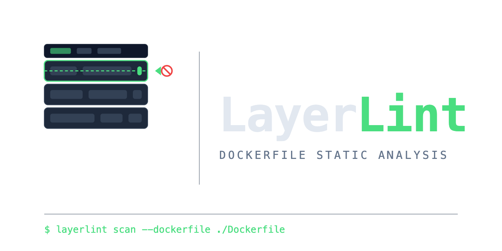

# LayerLint



Catches Dockerfile layer caching issues that slow down your builds.

## What

Changed one line of code and Docker rebuilt everything? Probably something in your Dockerfile breaking the layer cache. This tool finds those issues.

It checks for stuff like:
- Copying everything before `npm install` (so every code change reinstalls packages)
- Using `FROM node:latest` (reproducibility nightmare)
- Running as root (security issue)
- Missing `.dockerignore` (slow builds, leaks secrets)

Takes a second to run, tells you exactly what's broken and how to fix it.

## Install

**Quick:**
```bash
curl -sSL https://raw.githubusercontent.com/vviveksharma/layerLint/main/install.sh | sh
```

**Manual:** Grab a binary from [releases](https://github.com/vviveksharma/layerLint/releases) or build it:
```bash
git clone https://github.com/vviveksharma/layerLint
cd layerLint
make generate-build
```

## Usage

```bash
./layerlint scan --dockerfile Dockerfile
```

That's it. You'll see what's broken and how to fix it.

**Report formats:**
```bash
# Text output (default)
./layerlint scan --dockerfile Dockerfile

# JSON (for scripts/CI)
./layerlint scan --dockerfile Dockerfile --format json --output report.json

# SARIF (GitHub Security tab)
./layerlint scan --dockerfile Dockerfile --format sarif --output results.sarif

# HTML (for artifacts)
./layerlint scan --dockerfile Dockerfile --format html --output report.html
```

See [Report Generation Guide](docs/report-generation.md) for details.

## CI/CD Integration

### GitHub Actions

Basic workflow:
```yaml
name: Lint Dockerfile
on: [push, pull_request]

jobs:
  lint:
    runs-on: ubuntu-latest
    steps:
      - uses: actions/checkout@v3
      - name: Install LayerLint
        run: |
          curl -sSL https://github.com/vviveksharma/layerLint/releases/latest/download/layerLint_Linux_x86_64.tar.gz | tar xz
          chmod +x layerlint
      - name: Scan Dockerfile
        run: ./layerlint scan --dockerfile ./Dockerfile --fail-on-severity high
```

**Ready-to-use examples** in [`.github/workflows/examples/`](.github/workflows/examples/):
- [example-basic-lint.yml](.github/workflows/examples/example-basic-lint.yml) - Simple scan
- [example-multi-dockerfile.yml](.github/workflows/examples/example-multi-dockerfile.yml) - Scan multiple Dockerfiles
- [example-build-deploy.yml](.github/workflows/examples/example-build-deploy.yml) - Lint then build/push
- [example-scheduled-audit.yml](.github/workflows/examples/example-scheduled-audit.yml) - Weekly audit with issue creation

### Other Platforms

For GitLab CI, CircleCI, Jenkins, Azure Pipelines, etc., see the [CI/CD Integration Guide](docs/ci-cd-integration.md). Has working examples for all of them.

### Pre-commit Hook

```yaml
# .pre-commit-config.yaml
repos:
  - repo: local
    hooks:
      - id: layerlint
        name: LayerLint
        entry: layerlint scan --dockerfile
        language: system
        files: Dockerfile.*
        pass_filenames: true
```

## Testing

Got test Dockerfiles in `testFiles/` that break each rule on purpose. Try them:

```bash
./layerlint scan --dockerfile testFiles/broad-copy-before-deps-failure
```

Or run all:
```bash
for file in testFiles/*-failure; do
  echo "Testing: $file"
  ./layerlint scan --dockerfile "$file"
done
```

Each file triggers at least one violation. Useful for seeing what not to do.

## The Main Rule (The One That Matters Most)

### broad-copy-before-deps

This kills build performance. Don't do this:

```dockerfile
FROM golang:1.22
COPY . .              # Copies everything
RUN go mod download   # Every code change = re-download deps
```

Do this instead:

```dockerfile
FROM golang:1.22
COPY go.mod go.sum ./   # Just dependency files
RUN go mod download     # Cached unless go.mod changes
COPY . .                # Now copy source
```

Same pattern for npm, pip, poetry, etc. Copy dependency manifest first, install, then copy source.

### Other Rules

Check the [rules documentation](docs/rules.md) for the complete list. Quick summary:
- `unpinned-base-image-tag` - Using `:latest` instead of specific versions
- `apt-update-without-install` - Creates stale cache layers
- `copying-secrets-into-image` - Don't bake secrets into images
- `run-as-root` - Security issue
- `build-without-cache-mount` - Missing BuildKit cache mounts
- `wget-curl-without-checksum` - Supply chain risk
- Plus a few more...

## Output Format

When it finds issues:

```
RuleID:     dockerfile/broad-copy-before-deps
Severity:   high
File:       Dockerfile
Line:       4
Title:      Dependency install runs after broad source copy
Message:    This dependency step runs after a broad COPY/ADD, so source changes can invalidate the dependency cache.
Suggestion: Copy dependency manifests first, install dependencies, then copy the rest of the source.
```

Pretty clear what's wrong and how to fix it.

## Contributing

Code's straightforward. Rules are in `internal/rules/`, each one is its own file. To add a new rule:

1. Create a file in `internal/rules/`
2. Implement the `Rule` interface (`ID()` and `Check()`)
3. Register it in `internal/scanner/scaner.go`
4. Add a test file in `testFiles/`

Look at `broad_copy_before_deps.go` for an example. Build: `make generate-build`

## Why This Exists

Got tired of slow builds because of bad Dockerfiles. Wrote this instead of explaining the same caching issues repeatedly.

## Links

- [Rules Documentation](docs/rules.md) - What each rule checks
- [CI/CD Integration](docs/ci-cd-integration.md) - Platform-specific examples
- [Report Generation](docs/report-generation.md) - JSON/SARIF/HTML outputs
- [Releases](https://github.com/vviveksharma/layerLint/releases) - Download binaries

MIT License.
